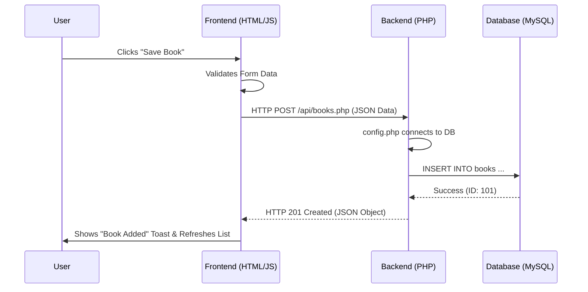

# 🎓 Presentation Guide: How Our System Communicates

This guide explains the "Journey of a Request" in our Library Management System. It tracks data from the user's click in the browser, through the JavaScript logic, to the PHP backend, and finally into the MySQL database.

---

## 🏗️ The 3-Layer Architecture

Our system is built using three distinct layers that work together:

1.  **Frontend (HTML/CSS)**: The "Face" of the app. It provides the buttons and forms the user interacts with.
2.  **Logic Layer (JavaScript)**: The "Brain" of the frontend. It manages navigation and sends requests to the server without reloading the page (AJAX).
3.  **Backend (PHP + MySQL)**: The "Engine and Storage". It processes requests, runs business logic, and saves data to the database.

---

## 🔄 The Communication Cycle (AJAX)

When you perform an action (like adding a book), the following cycle occurs:



---

## 🔍 Case Study: Adding a New Book

Let's look at exactly what happens in the code for each step:

### 1. The Trigger (HTML)
In `index.html`, the form has an `onsubmit` event:
```html
<form id="book-form" onsubmit="event.preventDefault(); saveBook()">
```
This tells the browser: "Don't refresh the page! Instead, run the `saveBook()` function in our JavaScript."

### 2. The Request (JavaScript)
In `app.js`, the `saveBook()` function gathers the data and uses our `ajax()` helper:
```javascript
async function saveBook() {
  const data = { title: "Dune", author: "Frank Herbert", ... };
  
  // Send the data to the server!
  await ajax('books.php', 'POST', data);
  
  toast('Book added', 'success');
  loadBooks(); // Update the UI
}
```
*   **Method**: `POST` (means "Create New").
*   **Data**: The book details are "stringified" into a JSON format.

### 3. The Processing (PHP)
On the server, `api/books.php` receives the request:
```php
if ($method === 'POST') {
    $body = getBody(); // Get the JSON data from JS
    
    // Run the SQL command
    executeUpdate(
        "INSERT INTO books (title, author, ...) VALUES (?, ?, ...)",
        [$body['title'], $body['author'], ...]
    );

    // Send a "Success" message back to JS
    respond(['message' => 'Book created'], 201);
}
```

---

## 💡 Key Concepts to Remember

> [!TIP]
> **What is JSON?**
> JSON (JavaScript Object Notation) is the "language" used for communication. It looks like this: `{"title": "Dune", "author": "Frank Herbert"}`. Both JavaScript and PHP understand it perfectly!

> [!IMPORTANT]
> **Why use AJAX?**
> AJAX allows us to update parts of the page (like the book list) without reloading the entire website. This makes the app feel fast and modern, like a mobile app.

> [!NOTE]
> **RESTful API**
> We use standard "Verbs" to tell the server what to do:
> - **GET**: "Read" data.
> - **POST**: "Create" new data.
> - **PUT**: "Update" existing data.
> - **DELETE**: "Remove" data.
